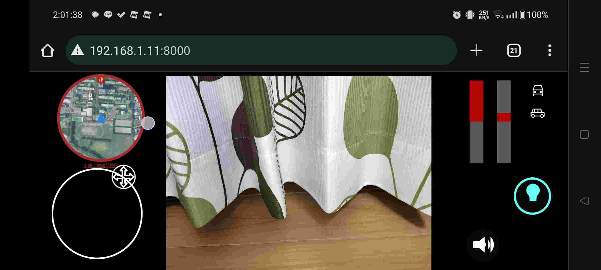

マイコンを直感的に遠隔操作するためのGUIです．
ゲームのような感覚で機体を制御できます．

使い方：
1. index.htmlと，start_gui.pyを使用したい場所にコピーします．
2. start_gui.pyを実行します．
3. 自動的にサーバーが立ち上げられます．
4. ↑の操作をした機器と同じWi-Fiに繋いでいる機器で， http://ローカルIPアドレス:8000 にアクセスします．

camera.jpgを別のプログラムから変更することで，ブラウザに表示される画像を更新できます

data_to_browserを別のプログラムから変更することで，ブラウザ上にモーターの出力などを表示できます

ブラウザでの操作は，自動的にdata_from_browserに記録されます．

GUI中で地理院地図を使用しているため，地図のスクリーンショットを組織外に頒布しないでください